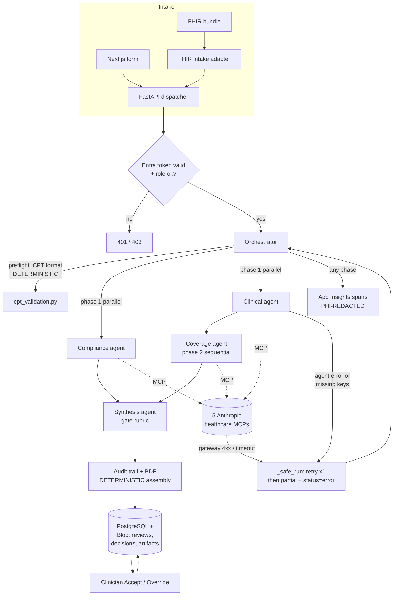

# ARCHITECTURE — Prior-Auth Multi-Agent: Production Hardening

> How the pieces fit — the accelerator as-is, and the target once hardened. Honest
> about trade-offs and failure paths, not just tidy boxes.

## Context

The system is a **payer-side PA review pipeline**. A PA request (patient, provider
NPI, diagnosis/procedure codes, clinical notes) enters, four specialized LLM agents
evaluate it, a gate-based rubric produces an APPROVE/PEND draft with confidence and
an audit justification, and a human clinician Accepts or Overrides. Today intake is a
Next.js form and the orchestrator is a **stateless FastAPI dispatcher** with no local
AI runtime — all reasoning runs in four independent **Foundry Hosted Agent**
containers reached via `AIProjectClient.get_openai_client(agent_name=...)` under
`DefaultAzureCredential`. The hardening effort keeps that shape and adds the four
things a demo omits: durable state, identity, real intake, and PHI-grade isolation.

## Components

Existing (keep) and new (add) share one table so the seams are explicit.

| Component | Single responsibility | Status |
|-----------|-----------------------|--------|
| Next.js frontend (`frontend/`) | Submit form, live SSE progress, tabbed agent details, Accept/Override panel | keep; add auth login + plan selector |
| FastAPI dispatcher (`backend/app`) | HTTP orchestration, SSE, response assembly — **no AI runtime** | keep; add authN/RBAC middleware |
| Orchestrator (`orchestrator.py`) | Fan-out/fan-in pipeline: preflight → parallel(compliance,clinical) → coverage → synthesis → audit | keep; swap `_review_store` for a store interface |
| Compliance / Clinical / Coverage / Synthesis agents (`agents/*`) | Each: one specialist review, structured output, own container + SKILL.md | keep; add commercial-policy SKILL variant |
| MCP data access (5 servers) | NPI, ICD-10, CMS Coverage, ClinicalTrials, PubMed via `MCPStreamableHTTPTool` | keep; treat as external dependency w/ failure handling |
| CPT validation + audit PDF (`services/`) | Deterministic code-format check; audit justification MD+PDF | keep; PDF now written to durable blob store |
| **Persistence store** (new) | Durable reviews/decisions/audit artifacts; recovery of completed runs | **new — replaces in-memory dict** |
| **Auth/RBAC layer** (new) | Validate Entra tokens; gate submit/review/override by role; stamp identity | **new** |
| **FHIR intake adapter** (new) | Map FHIR bundle → the pipeline's request dict | **new** |
| **Eval harness** (new) | Run labeled cases through the pipeline; score accuracy/PEND/latency | **new (offline)** |

## Data & control flow

Main path (a case) and one failure path (an agent/MCP failure) shown together.



Key honesty points the diagram encodes: intake has **two** front doors that converge
on one dispatcher; auth is a gate *before* the orchestrator, not inside it; the
preflight CPT check and the audit assembly are **deterministic scripts**, everything
in the agent boxes is **LLM judgment**; and the failure path is real — `_safe_run`
already retries once and degrades to a partial result with an `error`/`warning`
status rather than crashing, which is why R2 must distinguish "complete" from
"partial" when persisting.

## LLM-vs-script boundary (make it visible)

- **Deterministic (script, no model):** CPT/HCPCS format validation, tool-result
  status normalization, confidence *aggregation* math (`_compute_confidence`), audit
  trail/PDF assembly, FHIR→dict mapping, auth/RBAC checks, persistence. These must be
  unit-tested and must not regress — they are where correctness is cheap to guarantee.
- **Judgment (LLM agents):** documentation completeness, clinical extraction, ICD/NPI
  interpretation, coverage-criterion MET/NOT_MET/INSUFFICIENT calls, gate synthesis.
  These get *evaluated* (R7), not unit-tested for exact output.

## Key decisions (ADRs)

```
ADR-1 — Durable store: PostgreSQL over Cosmos DB
Decision: Persist reviews/decisions in Azure Database for PostgreSQL; audit
  PDFs/letters in Azure Blob Storage.
Options considered: PostgreSQL (accelerator's production-migration.md targets it);
  Cosmos DB (native Azure, serverless); keep in-memory (rejected — fails R1/R2).
Trade-off: Postgres gives relational audit queries + a documented migration path,
  at the cost of a managed server vs Cosmos's serverless scale-to-zero.
Consequence: orchestrator's _review_store becomes a repository interface; blob URIs
  replace the base64 PDF currently returned inline; N3 now needs a private endpoint
  to Postgres.
```
```
ADR-2 — Identity: Entra ID app roles + Managed Identity, no new secret store
Decision: Authenticate users via Entra ID; authorize via app roles (Reviewer,
  Coordinator, Auditor); services keep Managed Identity + DefaultAzureCredential.
Options considered: Entra app roles; external IdP/SSO; API keys (rejected — breaks
  the accelerator's keyless-by-design posture).
Trade-off: Entra-native keeps zero secrets to rotate but couples the deployment to
  an Entra tenant.
Consequence: every mutating endpoint gains a token+role check; decision rows carry
  an Entra object id; the frontend gains a login flow (MSAL).
```
```
ADR-3 — FHIR intake as an adapter, not a rewrite
Decision: Add a thin FHIR→request-dict adapter in front of the existing pipeline;
  do not make the pipeline natively FHIR.
Options considered: adapter (map a small resource set to today's dict); native FHIR
  models throughout (Da Vinci PAS); manual-form-only (rejected — fails R5).
Trade-off: the adapter is fast and low-risk but is not yet a conformant PAS
  responder; full PAS is deferred.
Consequence: one mapping module + its tests is the whole R5 surface; a later phase
  can grow it toward Da Vinci PAS without touching agents.
```
```
ADR-4 — Policy breadth via SKILL.md, not code
Decision: Add commercial/MA rulesets as new SKILL.md variants loaded by the agents'
  SkillsProvider; select per-request via a plan field.
Options considered: skills-based policy files (accelerator's own extension model);
  hard-coded policy branches in agent code (rejected — defeats skills architecture).
Trade-off: keeps domain rules editable by non-engineers, but plan selection must be
  threaded from intake → orchestrator → agent invocation.
Consequence: R6 needs a plan identifier on the request and a skill-resolution step;
  no agent Python changes.
```

## Risks & open questions

- **Hosted Agents / GPT-5.4 region + access.** The pipeline is hard-bound to a region
  where both preview/GA features and GPT-5.4 co-exist (East US 2 / Sweden Central) and
  to a granted GPT-5.4 subscription. Losing either blocks everything. *Note: the repo
  still labels Hosted Agents "refreshed preview," but Agent Framework 1.0 + Hosted
  Agents reached GA in 2026 — confirm the current SKU/region matrix at build time.*
- **MCP gateway is a third-party dependency.** Five external `*.mcp.claude.com`
  servers with a Cloudflare gateway (already needs a `User-Agent` workaround). Outages
  or contract changes degrade agent quality; the failure path handles errors but not
  a silent quality drop — the eval harness (R7) is the detector.
- **Agent output is non-deterministic** — structured output constrains shape, not
  content; correctness is asserted statistically (R7), never proven per-case. This is
  why the human gate is non-negotiable.
- **Labeled ground truth may not exist.** R7's value depends on a defensible labeled
  case set; if only synthetic cases exist, "accuracy" is agreement-with-intended, not
  clinical truth. Resolve in Phase 0.
- **Root-running agent containers.** Foundry injects `HOME=/home/session` as root and
  the agent images can't drop privileges — a known constraint to carry into the PHI
  threat model (N-series), not something this build removes.
